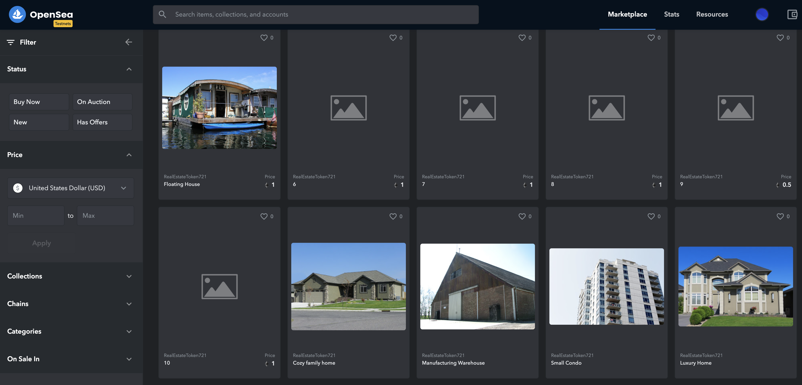

# Udacity Blockchain Capstone

The capstone will build upon the knowledge you have gained in the course in order to build a decentralized housing product. 

<br>

# How to install

This repository contains Smart Contract code in Solidity (using Truffle), tests (also using Truffle).

To install, download or clone the repo, then:

`npm install`  

`cd eth-contracts`  

Create a .secret and a .infurakey file in your __eth-contracts__ folder.  
See _Steps to migrate the contract to the Rinkeby Ethereum Testnet_ for info on what to add into the files (only needed if you want to migrate your smart contract to a network other than the local network).

`truffle compile`  

## Output of the migration:
**1. Test Case Execution Result**

```reStructuredText
(base) ip-192-168-0-101:eth-contracts admin$ truffle test ./test/*.js
Using network 'development'.


Compiling your contracts...
===========================
✔ Fetching solc version list from solc-bin. Attempt #1
> Everything is up to date, there is nothing to compile.


  Contract: TestERC721Mintable
    match erc721 spec
      ✓ should return total supply (70ms)
      ✓ should get token balance (56ms)
      ✓ should return token uri (66ms)
      ✓ should transfer token from one owner to another (196ms)
    have ownership properties
      ✓ should fail when minting when address is not contract owner (613ms)
      ✓ should return contract owner (70ms)

  Contract: TestSolnSquareVerifier
    ✓ Test if a new solution can be added for contract (822ms)
    ✓ Test if an ERC721 token can be minted for contract (759ms)
    ✓ Test if an ERC721 token can be minted for contract with incorrect proof (1356ms)

  Contract: SquareVerifier
    Testing the SquareVerifier
      ✓ Test verification with correct proof (632ms)
      ✓ Test verification with incorrect proof (709ms)


  11 passing (15s)

```

**2. Rinkeby migration result**

```javascript
(base) ip-192-168-0-101:eth-contracts admin$ truffle migrate --network rinkeby

Compiling your contracts...
===========================
✔ Fetching solc version list from solc-bin. Attempt #1
> Everything is up to date, there is nothing to compile.


Migrations dry-run (simulation)
===============================
> Network name:    'rinkeby-fork'
> Network id:      4
> Block gas limit: 29999943 (0x1c9c347)


1_initial_migration.js
======================

   Deploying 'Migrations'
   ----------------------
   > block number:        9321498
   > block timestamp:     1632078177
   > account:             0x11c223D1E31D083641aEE615A116e1b1B46eC868
   > balance:             0.702927330498003155
   > gas used:            210237 (0x3353d)
   > gas price:           10 gwei
   > value sent:          0 ETH
   > total cost:          0.00210237 ETH

   -------------------------------------
   > Total cost:          0.00210237 ETH


2_deploy_contracts.js
=====================

   Deploying 'SquareVerifier'
   --------------------------
   > block number:        9321500
   > block timestamp:     1632078190
   > account:             0x11c223D1E31D083641aEE615A116e1b1B46eC868
   > balance:             0.692977390498003155
   > gas used:            967631 (0xec3cf)
   > gas price:           10 gwei
   > value sent:          0 ETH
   > total cost:          0.00967631 ETH


   Deploying 'SolnSquareVerifier'
   ------------------------------
   > block number:        9321501
   > block timestamp:     1632078255
   > account:             0x11c223D1E31D083641aEE615A116e1b1B46eC868
   > balance:             0.660275960498003155
   > gas used:            3270143 (0x31e5ff)
   > gas price:           10 gwei
   > value sent:          0 ETH
   > total cost:          0.03270143 ETH

   -------------------------------------
   > Total cost:          0.04237774 ETH


Summary
=======
> Total deployments:   3
> Final cost:          0.04448011 ETH


Starting migrations...
======================
> Network name:    'rinkeby'
> Network id:      4
> Block gas limit: 30000000 (0x1c9c380)


1_initial_migration.js
======================

   Deploying 'Migrations'
   ----------------------
   > transaction hash:    0xc237970036423789e398f36aae2c32442cf989bb4579feb04df1915d7009ef26
   > Blocks: 1            Seconds: 13
   > contract address:    0x2955F91A1cE370E49e0ABc9CAf73B70e3509124a
   > block number:        9321507
   > block timestamp:     1632078319
   > account:             0x11c223D1E31D083641aEE615A116e1b1B46eC868
   > balance:             0.702764330498003155
   > gas used:            226537 (0x374e9)
   > gas price:           10 gwei
   > value sent:          0 ETH
   > total cost:          0.00226537 ETH


   > Saving migration to chain.
   > Saving artifacts
   -------------------------------------
   > Total cost:          0.00226537 ETH


2_deploy_contracts.js
=====================

   Deploying 'SquareVerifier'
   --------------------------
   > transaction hash:    0x2ab4ca1a425614f050223086b058e90538bb9e174ad3cfb435b078964a69fec3
   > Blocks: 1            Seconds: 9
   > contract address:    0x03e97290eC44B71588377E5780f32BaFF20bEaE1
   > block number:        9321509
   > block timestamp:     1632078349
   > account:             0x11c223D1E31D083641aEE615A116e1b1B46eC868
   > balance:             0.692630390498003155
   > gas used:            967631 (0xec3cf)
   > gas price:           10 gwei
   > value sent:          0 ETH
   > total cost:          0.00967631 ETH


   Deploying 'SolnSquareVerifier'
   ------------------------------
   > transaction hash:    0xd856322e576711c373ecf7c624fb6479ac9a003447a7faaa9ffa2a110e1eeff9
   > Blocks: 1            Seconds: 17
   > contract address:    0xDA0cA49cbf82895FfC96DF2769f10aB2E70e35b4
   > block number:        9321511
   > block timestamp:     1632078379
   > account:             0x11c223D1E31D083641aEE615A116e1b1B46eC868
   > balance:             0.658133960498003155
   > gas used:            3449643 (0x34a32b)
   > gas price:           10 gwei
   > value sent:          0 ETH
   > total cost:          0.03449643 ETH


   > Saving migration to chain.
   > Saving artifacts
   -------------------------------------
   > Total cost:          0.04417274 ETH


Summary
=======
> Total deployments:   3
> Final cost:          0.04643811 ETH
```


# Mint your tokens

Using MetaMask with MEW
- Login to your MetaMask wallet via their Chrome Extension.
- On the MEW front page, select 'Access My Wallet'.
- Select the 'Browser Extension' option to connect.
- Read and accept the 'Terms and Conditions', then select 'Access My Wallet'.
- Confirm connection in the MetaMask pop-up window.
- You're done!

Within the MEW account go to https://www.myetherwallet.com/interface/interact-with-contract and mint some tokens.

# OpenSea

Marketplace: https://testnets.opensea.io/assets/realestatetoken721



Assets:

Belongs to [0x6c3850f04b48817557afab3c79015c3e86d6d0e5](https://testnets.opensea.io/0x6c3850f04b48817557afab3c79015c3e86d6d0e5) (Creator):
https://testnets.opensea.io/assets/0x4c05a0870e35d9a2c6a6e00e7d981c547a71b99e/1
https://testnets.opensea.io/assets/0x4c05a0870e35d9a2c6a6e00e7d981c547a71b99e/2
https://testnets.opensea.io/assets/0x4c05a0870e35d9a2c6a6e00e7d981c547a71b99e/3
https://testnets.opensea.io/assets/0x4c05a0870e35d9a2c6a6e00e7d981c547a71b99e/4
https://testnets.opensea.io/assets/0x4c05a0870e35d9a2c6a6e00e7d981c547a71b99e/10

Bought from [0xE9DEa8A0c6724Dbc1B837Bd56FCDf36f0d954b51](https://testnets.opensea.io/0xe9dea8a0c6724dbc1b837bd56fcdf36f0d954b51):
https://testnets.opensea.io/assets/0x4c05a0870e35d9a2c6a6e00e7d981c547a71b99e/5
https://testnets.opensea.io/assets/0x4c05a0870e35d9a2c6a6e00e7d981c547a71b99e/6
https://testnets.opensea.io/assets/0x4c05a0870e35d9a2c6a6e00e7d981c547a71b99e/7
https://testnets.opensea.io/assets/0x4c05a0870e35d9a2c6a6e00e7d981c547a71b99e/8
https://testnets.opensea.io/assets/0x4c05a0870e35d9a2c6a6e00e7d981c547a71b99e/9

<br>

# Versions

`truffle version`

> Truffle v5.3.2 (core: 5.3.2)  
> Solidity - ^0.5.0 (solc-js)  
> Node v15.14.0  
> Web3.js v1.3.5

<br>

# Project Resources

* [Remix - Solidity IDE](https://remix.ethereum.org/)
* [Visual Studio Code](https://code.visualstudio.com/)
* [Truffle Framework](https://truffleframework.com/)
* [Ganache - One Click Blockchain](https://truffleframework.com/ganache)
* [Open Zeppelin ](https://openzeppelin.org/)
* [Interactive zero knowledge 3-colorability demonstration](http://web.mit.edu/~ezyang/Public/graph/svg.html)
* [Docker](https://docs.docker.com/install/)
* [ZoKrates](https://github.com/Zokrates/ZoKrates)
